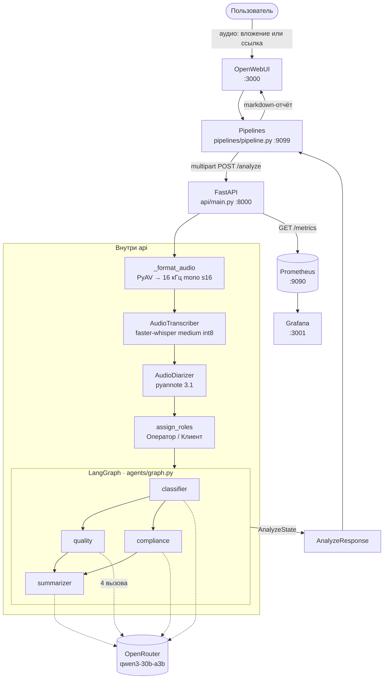

# 🏦 Речевая аналитика контакт-центра МТБанка

Система превращает запись звонка в готовый для супервайзера отчёт: транскрибирует
русскую речь, разделяет реплики на **Оператора** и **Клиента**, прогоняет диалог
через четырёх LLM-агентов и отдаёт результат тремя способами — как ответ в чате
OpenWebUI, как JSON из REST API и как метрики на дашборде Grafana.

Решение тестового задания на позицию AI Engineer. Исходный текст ТЗ — в
[`docs/task.md`](docs/task.md).

---

## 🌐 Живое демо

<!-- ЗАПОЛНИТЬ ПЕРЕД СДАЧЕЙ: только HTTPS, доступ без VPN -->

| Что | Ссылка |
|---|---|
| **OpenWebUI** — чат с пайплайном | [openwebui](https://mtbank.work.gd/) |
| **Grafana** — дашборд «MTBank — Аналитика звонков» | [grafana](https://mtbank.work.gd/grafana/d/mtbank-calls/mtbank-e28094-analitika-zvonkov?orgId=1&from=now-6h&to=now&timezone=browser&refresh=30s)|

<!--
Демо-сценарий для проверяющего:
1. В OpenWebUI выбрать модель «Audio File Аnalysis Pipeline».
2. Приложить файл test_data/call_dialog.wav (или прислать прямую ссылку на аудио).
3. Дождаться отчёта — статусы выполнения приходят в чат по ходу анализа.
-->

---

## 📋 Содержание

- [Что делает система](#что-делает-система)
- [Архитектура](#архитектура)
- [Обоснование технических решений](#обоснование-технических-решений)
- [Запуск](#запуск)
- [Тесты](#тесты)
- [Тестовые данные и качество ASR](#тестовые-данные-и-качество-asr)
- [Метрики и Grafana-дашборд](#метрики-и-grafana-дашборд)
- [Ограничения среды исполнения](#ограничения-среды-исполнения)
- [Что дальше](#что-дальше)

---

## Что делает система

- **Приём аудио** — WAV, MP3, OGG; вложением в чат OpenWebUI или прямой ссылкой.
  Любой sample rate и число каналов: 8 кГц μ-law, 44.1 кГц стерео MP3 и 48 кГц Opus
  нормализуются к одному внутреннему формату.
- **Транскрибация** — `faster-whisper medium`, русский язык, сегменты с таймкодами.
- **Диаризация с ролями** — `pyannote/speaker-diarization-3.1` даёт кластеры
  говорящих, роли «Оператор» / «Клиент» назначаются по содержанию реплик.
- **Четыре агента** — классификатор темы и приоритета, оценка качества по чеклисту,
  комплаенс-контроль, суммаризатор с action items. Оркестрация — LangGraph.
- **Три канала вывода** — markdown-отчёт в чате, строгий JSON из `POST /analyze`,
  Prometheus-метрики на дашборде Grafana.
- **Наблюдаемость** — JSON-логи structlog со входом и выходом каждого агента,
  15 доменных метрик, готовый дашборд из пяти рядов панелей.

### Ответ API

`POST /analyze` с `multipart/form-data` возвращает объект, описанный моделью
`AnalyzeResponse` в [`api/main.py`](api/main.py):

```json
{
  "transcript": [
    { "speaker": "Оператор", "start": 0.0, "end": 4.2, "text": "Добрый день, МТБанк, меня зовут Анна." },
    { "speaker": "Клиент",   "start": 4.5, "end": 8.1, "text": "Здравствуйте, хочу узнать про кредит." }
  ],
  "classification": { "topic": "credits", "priority": "medium" },
  "quality_score": {
    "total": 88,
    "checklist": {
      "greeting": true,
      "need_detection": true,
      "solution_provided": true,
      "farewell": false
    },
    "comment": "Оператор выявил потребность и предложил решение, но не подвёл итог разговора."
  },
  "compliance": {
    "passed": false,
    "issues": [
      {
        "rule": "Точная ставка без оговорки о рассмотрении заявки",
        "severity": "medium",
        "quote": "Ставка будет 13 процентов годовых",
        "comment": "Условия названы окончательными до решения банка по заявке."
      }
    ]
  },
  "summary": "Клиент обратился за консультацией по кредиту наличными…",
  "action_items": ["Отправить предварительный расчёт на email клиента"]
}
```

### Ответ в чате

Тот же результат [`pipelines/pipeline.py`](pipelines/pipeline.py) рендерит в markdown:
сводная таблица (тема, приоритет, качество, комплаенс), резюме, чеклист оператора,
список нарушений с дословными цитатами, чекбоксы action items и транскрипт под
спойлером. Анализ идёт минутами, поэтому ответ стримится: пользователь видит
статусы «Файл получен», «Отправляю на анализ», «Анализ завершён», а не пустой экран.

---

## Архитектура



| Компонент | Файл | Ответственность |
|---|---|---|
| OpenWebUI Pipeline | [`pipelines/pipeline.py`](pipelines/pipeline.py) | Достать файл из вложения или ссылки, стримить статусы, отрендерить markdown-отчёт |
| REST API | [`api/main.py`](api/main.py) | Валидация загрузки, нормализация аудио, оркестрация стадий, единый контракт ответа |
| Конфигурация | [`api/config.py`](api/config.py) | Все параметры через `.env`, pydantic-settings |
| Логи | [`api/logging_config.py`](api/logging_config.py), [`api/logging_middleware.py`](api/logging_middleware.py) | JSON-логи structlog, `request_id` на запрос |
| Метрики | [`api/metrics.py`](api/metrics.py) | 15 доменных метрик Prometheus |
| ASR | [`asr/transcriber.py`](asr/transcriber.py) | faster-whisper, сегменты с таймкодами |
| Диаризация | [`asr/diarizer.py`](asr/diarizer.py) | pyannote, сопоставление сегментов с кластерами |
| Роли | [`asr/roles.py`](asr/roles.py) | Лексическое определение, какой кластер — оператор |
| Оркестрация | [`agents/graph.py`](agents/graph.py) | Граф LangGraph, общий `AnalyzeState` |
| Агенты | [`agents/classifier.py`](agents/classifier.py), [`quality.py`](agents/quality.py), [`compliance.py`](agents/compliance.py), [`summarizer.py`](agents/summarizer.py) | Промпт + pydantic-схема + метрики на каждого |

**Граница между пайплайном и API проведена намеренно.** Пайплайн OpenWebUI — это
только ввод-вывод: разобрать сообщение, скачать файл, показать прогресс, отрисовать
markdown. Ни одной строки доменной логики в нём нет — он не знает ни про Whisper, ни
про LLM. Отсюда два практических следствия: пайплайн полностью тестируется без ASR и
без сети ([`tests/test_openwebui_pipeline.py`](tests/test_openwebui_pipeline.py)), а
тот же самый `/analyze` доступен как обычный REST-эндпоинт для интеграции с любой
другой системой — CRM, скриптом массовой обработки архива звонков, вторым фронтендом.

---

## Обоснование технических решений

### LLM: `qwen/qwen3-30b-a3b-instruct-2507` через OpenRouter

Модель задаётся переменной `OPENROUTER_MODEL`, клиент —
[`agents/__init__.py`](agents/__init__.py): `ChatOpenAI` с
`base_url=https://openrouter.ai/api/v1`, `temperature=0.0`, лимит на длину ответа.

Почему именно так:

- **OpenAI-совместимый эндпоинт вместо SDK конкретного вендора.** Провайдер и модель
  меняются одной переменной окружения, код не трогается вообще. Переезд на локальный
  vLLM или Ollama, на облачный Groq/Together или на корпоративный инференс внутри
  периметра банка — это правка `.env`, а не рефакторинг. Для банка это существенно:
  требования к тому, где физически обрабатываются записи разговоров, обычно приходят
  позже, чем пишется прототип.
- **MoE-архитектура под четыре вызова на звонок.** У `qwen3-30b-a3b` при 30 млрд
  параметров активны около 3 млрд на токен: качество плотной модели среднего размера
  при стоимости и латентности маленькой. На каждый звонок приходится четыре
  независимых LLM-вызова, и цена ошибки в выборе модели умножается на четыре.
- **Сильный русский язык.** Весь домен русскоязычный — и диалоги, и промпты, и
  комментарии агентов в ответе. Модели с преимущественно английским корпусом здесь
  теряют на терминологии и на разговорных формулировках клиента.
- **Надёжный structured output.** Все четыре агента работают через
  `with_structured_output(...)` с pydantic-схемой, то есть модель обязана отдавать
  строгий JSON, попадающий в схему. Qwen3 в этом режиме устойчив, ретраев и
  «починки» текста в коде не потребовалось.
- **`temperature=0`.** Оценка качества работы оператора и вывод комплаенс-контроля
  влияют на людей. Один и тот же звонок должен получать один и тот же балл, поэтому
  сэмплирование отключено.

Локальный инференс без GPU рассматривался и отвергнут не по качеству, а по времени
отклика: на CPU четыре вызова 7B-модели дают минуты сверх времени ASR. Возврат к
локальной модели, как сказано выше, стоит одной строки конфигурации.

### Оркестрация: LangGraph

Граф собирается в [`agents/graph.py`](agents/graph.py) и имеет форму
`classifier → (quality ∥ compliance) → summarizer`.

Форма графа и есть аргумент. Классификация идёт первой, оценка качества и
комплаенс-проверка друг от друга не зависят и стоят параллельными ветвями, а
суммаризатор ждёт обе. LangGraph выполняет ветвление и слияние сам и сам же
аккумулирует общий `AnalyzeState` (TypedDict), — не нужно ни руками синхронизировать
ветви, ни передавать словарь по цепочке, ни следить за тем, чтобы каждая нода
дописывала своё поле, не затирая чужое.

Супервайзер на LLM здесь был бы лишним: маршрут известен статически, и отдельный
вызов модели ради решения «кого запустить следующим» добавил бы латентность,
стоимость и источник недетерминизма — ровно там, где нужна воспроизводимость.
Собственный супервайзер на `asyncio` дал бы то же самое, что LangGraph, но своим
кодом, который пришлось бы тестировать. При этом расширяемость сохранена: пятый агент
(например, агент трендов) — это одна нода и одно ребро, а не переписывание
оркестратора.

### ASR: faster-whisper `medium`, `int8`, CPU

[`asr/transcriber.py`](asr/transcriber.py). `faster-whisper` — реализация Whisper на
CTranslate2, кратно быстрее референсного `openai-whisper` при той же модели и тех же
весах. Квантизация `int8` держит `medium` примерно в 2 ГБ RSS вместо ~5 ГБ в fp32 —
это то, что позволяет всему стеку помещаться на обычной машине без GPU.

Детали, которые заметно влияют на результат:

- **`language=ru` зафиксирован**, а не определяется автоматически. На коротких файлах
  автоопределение языка ошибается — в выборке есть пятисекундный `short_greeting.mp3`,
  на котором это проявилось бы сразу.
- **`beam_size=5`** — компромисс между качеством и RTF, значение вынесено в `.env`.
- **VAD с `min_silence_duration_ms=500`** отсекает паузы, не разрезая при этом
  реплики по внутренним запинкам.
- **Модель, устройство и тип вычислений — параметры конфигурации**
  ([`api/config.py`](api/config.py)), а не константы в коде. Переключение на GPU или
  на другой размер модели не требует изменений в коде.
- **Веса кешируются в docker-volume** `whisper_cache`: скачивание ~1.5 ГБ происходит
  один раз, повторные запуски мгновенные.

Отдельно — нормализация входа в `_format_audio` ([`api/main.py`](api/main.py)). Любой
контейнер декодируется через PyAV и приводится к 16 кГц mono s16 ещё до ASR. Поэтому
телефонные 8 кГц μ-law, стерео MP3 44.1 кГц и Opus 48 кГц обрабатываются одним и тем
же кодом, а `ffmpeg` как внешний бинарник в образе не нужен — PyAV приносит
libav с собой.

### Диаризация: pyannote 3.1 + лексическое определение ролей

pyannote отвечает на вопрос «сколько человек говорит и когда», но не на вопрос «кто из
них оператор»: наружу выходят анонимные кластеры `SPEAKER_00` / `SPEAKER_01`. ТЗ же
требует ролей — и от них зависят все агенты, потому что оценивать качество и комплаенс
нужно строго по репликам оператора.

Очевидная эвристика «кто заговорил первым — тот оператор» ломается ровно там, где
дороже всего: на входящем звонке, где первым говорит клиент, роли меняются местами и
качество оператора считается по репликам клиента. Поэтому роли определяются по
содержанию ([`asr/roles.py`](asr/roles.py)):

- маркеры операторского скрипта («меня зовут», «оставайтесь на линии», «оформлю
  заявку») против клиентских («у меня проблема», «хочу узнать», «с моей карты»);
- асимметрия «вы» против «я» — признак языковой, а не сценарный, поэтому работает и
  на репликах вне скрипта;
- средняя длина реплики как слабый дополнительный сигнал;
- маркеры нормируются на число реплик, иначе оператором объявлялся бы просто тот, кто
  дольше говорил.

Оператором становится кластер с максимальным score. Если отрыв лидера меньше
`MARGIN_THRESHOLD`, содержательного сигнала не хватило — происходит явный откат на
порядковый выбор, и этот факт виден снаружи: в метрике
`diarization_role_assignment_total{method="fallback_order"}` и в логе
`role_assignment_low_confidence`. Молча угадывать система не будет.

Плюс мелочь, которая на практике важна: сегмент Whisper иногда не пересекается ни с
одним turn диаризации (пауза, обрезка по VAD). Такой сегмент подтягивается к
ближайшему turn, если тот ближе трёх секунд ([`asr/diarizer.py`](asr/diarizer.py)) —
иначе реплика ушла бы в промпты как «Неизвестно» и выпала из оценки оператора.

**Деградация мягкая.** Без `HF_TOKEN` сервис поднимается и `/analyze` отрабатывает
целиком, просто без ролей. Ошибка диаризации на конкретном файле не роняет запрос:
она логируется, инкрементирует `diarization_failures_total`, и анализ идёт дальше по
транскрипту. Единственная стадия, отказ которой обязан прерывать запрос, — это сам
ASR, потому что без текста анализировать нечего.

### Промпты и структурированный вывод

Каждый агент — это связка «системный промпт + pydantic-схема ответа + метрика».
Схема описывается через `Field(description=...)` и уходит в модель как контракт, а не
разбирается регулярками из текста. Категориальные поля — это `StrEnum`
(`Topic`, `Priority`, `Severity`), что даёт двойную выгоду: пространство ответов
закрыто, и лейблы метрик автоматически имеют ограниченную кардинальность.

Общие приёмы в промптах:

- **Секции в XML-тегах** (`<checklist>`, `<forbidden_phrases>`, `<scoring>`) — модель
  устойчивее держит границы блоков, чем при списках в свободной форме.
- **Правила разведения близких понятий.** У классификатора отдельный блок про то, что
  недовольство проблемой с картой — это `topic=cards`, а не `complaints`, и что риск
  мошенничества влияет на `priority`, но не подменяет `topic`.
- **Few-shot примеры** на каждом агенте, включая пограничные случаи.
- **Явный запрет додумывать.** «Не выдумывай факты, которых нет в диалоге», «короткий
  транскрипт сам по себе нарушением не является» — LLM-судья без этого штрафует
  обрывочные записи.
- **Разделение ответственности говорящих.** Качество и комплаенс оцениваются только по
  репликам оператора; клиент может грубить или называть свои данные — это не нарушение
  оператора. Реплики «Неизвестно» учитываются, только если по содержанию очевидно, чьи
  они.
- **Проверяемость вывода.** Каждое нарушение комплаенса обязано содержать дословную
  цитату, а если точную цитату привести нельзя — нарушение не фиксируется. Супервайзер
  может проверить вердикт, не переслушивая звонок, а модели закрыт самый частый способ
  ошибиться — придумать нарушение по общему впечатлению.
- **Согласованность численной оценки со структурой.** У агента качества прописаны веса
  пунктов (greeting 20, need_detection 30, solution_provided 35, farewell 15) и
  требование согласовать `total` с чеклистом, чтобы балл не жил своей жизнью отдельно
  от галочек.

Пустой транскрипт в модель не отправляется вовсе: агенты возвращают безопасный дефолт
и пишут `agent_skipped` — на пустом звонке не тратится ни один вызов LLM.

### Наблюдаемость: structlog + Prometheus

JSON-логи с событиями на каждой границе (`agent_started` / `agent_completed` /
`agent_failed`, `transcription_completed`, `diarization_finished`,
`analysis_graph_completed`), `request_id` на запрос через middleware. В тех же точках
пишутся метрики — подробности в разделе
[Метрики и Grafana-дашборд](#метрики-и-grafana-дашборд).

### Инфраструктура

- **`uv` + `uv.lock`** — воспроизводимая установка, единый инструмент для зависимостей
  и запуска.
- **CPU-колёса torch на Linux** через `tool.uv.sources` в
  [`pyproject.toml`](pyproject.toml): в CI и Docker ставится CPU-сборка вместо ~3 ГБ
  CUDA-варианта, на macOS остаются обычные колёса с PyPI. Образ меньше в разы, а
  сервис всё равно работает на CPU.
- **Docker Compose** — пять сервисов в одной сети, `docker compose up` поднимает весь
  стек. Соединение OpenWebUI с Pipelines и Prometheus с Grafana прописано заранее:
  руками ничего подключать не нужно.
- **`start_period: 600s`** в healthcheck `api` — первая загрузка модели легально
  занимает минуты, и контейнер не должен считаться упавшим всё это время.
- **CI** — два workflow GitHub Actions: юнит-тесты с линтером (ruff) и отдельный
  интеграционный прогон с реальным вызовом OpenRouter.

---

## Запуск

**Требования:** Docker с лимитом памяти **не меньше 6 ГБ**. `faster-whisper medium`
в `int8` занимает ~2 ГБ RSS, плюс torch и веса pyannote. На Docker Desktop лимит
задаётся в Settings → Resources → Memory; дефолтных 2 ГБ не хватает, контейнер
`api` убивает OOM-киллер (`docker compose ps` покажет бесконечный рестарт,
`docker inspect mtbank-api` — `ExitCode: 137`).

```bash
cp .env.example .env        # вписать OPENROUTER_API_KEY и HF_TOKEN
docker compose up --build
```

Поднимаются пять сервисов в общей сети:

| Сервис | Порт | Что это |
|---|---|---|
| `openwebui` | http://localhost:3000 | Чат. Соединение с pipelines прописано автоматически, пайплайн `Audio File Аnalysis Pipeline` сразу в списке моделей |
| `pipelines` | http://localhost:9099 | OpenWebUI Pipelines с [`pipelines/pipeline.py`](pipelines/pipeline.py) |
| `api` | http://localhost:8000 | FastAPI: ASR + диаризация + LangGraph-агенты, `POST /analyze` |
| `prometheus` | http://localhost:9090 | Сбор метрик с `api:8000/metrics`, retention 15 дней |
| `grafana` | http://localhost:3001 | Дашборд `MTBank — Аналитика звонков`, уже загружен. Открывается без логина |

Проверка без UI:

```bash
curl localhost:8000/health
curl -F file=@test_data/deposit_question.ogg localhost:8000/analyze
```

**Что важно знать про первый запуск:**

- `api` качает `faster-whisper medium` (~1.5 ГБ) на старте — до нескольких минут.
  Готовность видна по `/health` или `docker compose ps` (статус `healthy`).
  Модель кешируется в volume `whisper_cache`, повторные запуски мгновенные.
- Без `HF_TOKEN` (токен Hugging Face с принятой лицензией
  `pyannote/speaker-diarization-3.1`) сервис поднимается, но диаризации нет —
  реплики остаются без ролей Оператор/Клиент.
- Загрузка файла **вложением** в чат требует `OPENWEBUI_API_KEY` — JWT из
  OpenWebUI → Settings → Account. Анализ по прямой ссылке на аудио работает без него.
- Если памяти всё же мало, стек поднимется на уменьшенной модели:
  `WHISPER_MODEL_SIZE=tiny` и `DIARIZATION_ENABLED=false` в `.env`. Качество ASR
  просядет, ролей Оператор/Клиент не будет, но весь контракт `/analyze`
  отрабатывает целиком.
- Адреса сервисов пайплайн берёт из переменных окружения, но если он уже
  сохранял валвы через UI, файл `pipelines/pipeline/valves.json` их перекроет.
  В git этот файл не попадает.

### Локально, без Docker

```bash
uv sync
uv run uvicorn api.main:app --reload --port 8000
```

Нужны те же переменные окружения — проще всего заполнить `.env` в корне репозитория,
[`api/config.py`](api/config.py) читает его автоматически.

---

## Тесты

```bash
uv sync --group dev
uv run pytest -m "not integration"   # без сети и без ключей
uv run pytest -m integration         # реальные вызовы OpenRouter, нужен ключ
uv run ruff check .
```

| Файл | Что покрывает |
|---|---|
| [`tests/test_agents.py`](tests/test_agents.py) | Юнит-тест на каждого из четырёх агентов: контракт схемы, пустой транскрипт, ошибка LLM, отсутствие конфигурации |
| [`tests/test_pipeline.py`](tests/test_pipeline.py) | Граф LangGraph и эндпоинт `/analyze` с замоканными ASR и LLM |
| [`tests/test_pipeline_integration.py`](tests/test_pipeline_integration.py) | Интеграционный прогон с настоящей моделью (маркер `integration`) |
| [`tests/test_openwebui_pipeline.py`](tests/test_openwebui_pipeline.py) | Пайплайн OpenWebUI: разбор вложений и ссылок, лимит размера, определение имени файла, рендер отчёта, ветки ошибок |
| [`tests/test_roles.py`](tests/test_roles.py) | Назначение ролей: маркеры, местоимения, порог уверенности, откат |
| [`tests/test_diarizer.py`](tests/test_diarizer.py) | Сопоставление сегментов с кластерами, подтягивание к ближайшему turn, «Неизвестно» |
| [`tests/test_audio_fixtures.py`](tests/test_audio_fixtures.py) | Негативные аудио-фикстуры: коды 400/422 и ветка пустого транскрипта |
| [`tests/test_metrics.py`](tests/test_metrics.py) | Метрики пишутся в правильных точках с правильными лейблами |

---

## Тестовые данные и качество ASR

Полное описание каждого файла — в [`test_data/README.md`](test_data/README.md).

Всё аудио синтезировано через edge-tts голосами `ru-RU-SvetlanaNeural` (Оператор)
и `ru-RU-DmitryNeural` (Клиент) и **воспроизводится одной командой**:

```bash
uv sync --group dev
uv run python scripts/make_test_data.py --force   # генерация test_data/
uv run python scripts/eval_wer.py                 # таблица ниже
```

### Состав

**6 позитивных файлов, 7 минут 12 секунд суммарно** (требуется 5 минут):

| Файл | Сценарий | Длит. | Формат | Зачем |
|---|---|---|---|---|
| `call_dialog.wav` | Кредит наличными, Анна и Михаил (сценарий из `docs/sample-dialog.md`) | 2:16 | WAV 16 кГц моно | Диалог двух говорящих для диаризации |
| `call_dialog_8k.wav` | Тот же звонок через телефонный кодек | 2:16 | WAV **μ-law 8 кГц** | Телефонное качество |
| `card_block.mp3` | Блокировка утерянной карты | 1:06 | **MP3 44.1 кГц стерео** | MP3 + downmix стерео→моно |
| `complaint_violation.wav` | Конфликтный звонок с нарушениями регламента | 1:01 | WAV 16 кГц моно | Негатив для quality/compliance-агентов |
| `deposit_question.ogg` | Вопрос по ставке вклада | 0:29 | **OGG/Opus 48 кГц** | Третий формат |
| `short_greeting.mp3` | Односложное обращение | 0:05 | MP3 22.05 кГц | Граничный кейс короткого файла |

Плюс **5 негативных фикстур** в `test_data/negative/` (пустой файл, текст под
видом аудио, битый OGG, контейнер без аудиодорожки, 30 секунд тишины) — они
прогоняются автоматически в [`tests/test_audio_fixtures.py`](tests/test_audio_fixtures.py)
и проверяют коды 400/422 и ветку пустого транскрипта.

### WER

`faster-whisper medium`, CPU, `int8`, `beam_size=5`. RTF — отношение времени
распознавания к длительности записи.

| Файл | Кодек | Sample rate | Длительность | Сегментов | Время ASR | RTF | WER | CER |
|---|---|---|---|---|---|---|---|---|
| `call_dialog.wav` | pcm_s16le | 16000 Гц | 136 с | 33 | 78 с | 0.57 | **8.7%** | 1.5% |
| `call_dialog_8k.wav` | pcm_mulaw | 8000 Гц | 136 с | 28 | 94 с | 0.69 | **8.7%** | 3.1% |
| `card_block.mp3` | mp3 | 44100 Гц | 66 с | 18 | 41 с | 0.63 | **2.0%** | 0.2% |
| `complaint_violation.wav` | pcm_s16le | 16000 Гц | 61 с | 19 | 37 с | 0.61 | **0.0%** | 0.0% |
| `deposit_question.ogg` | opus | 48000 Гц | 29 с | 8 | 14 с | 0.47 | **4.7%** | 0.3% |
| `short_greeting.mp3` | mp3 | 22050 Гц | 5 с | 1 | 7 с | 1.48 | **0.0%** | 0.0% |
| **Итого** | | | **432 с** | | **270 с** | **0.63** | **6.1%** | **1.5%** |

Итоговые значения — средневзвешенные по длительности.

**Как читать эти числа.** Перед сравнением эталон и гипотеза нормализуются
(регистр, `ё`→`е`, пунктуация, цифры прописью через `num2words`): Whisper
применяет inverse text normalization и пишет «10 тысяч» там, где произнесено
«десять тысяч», а «процентов» — как «%». Без этого WER показывал бы разницу в
форматировании, а не ошибки распознавания (было 10.6% против 8.7% на
`call_dialog.wav`).

Остаточные 6.1% WER при **1.5% CER** — это в основном не ошибки распознавания,
а расхождения в токенизации: `мтбанк` → `мт банк`, `email` → `e mail`. Каждый
такой случай даёт две словарные ошибки при почти нулевой символьной. Поэтому в
таблице приведены обе метрики: CER честнее отражает качество на этой выборке.
Единственная содержательная ошибка — продиктованный по буквам адрес
(`михаил-собака-пример-точка-бай` → `михаил собакопримербай`).

Падения качества на 8 кГц **не видно** (8.7% против 8.7%): CER всё же выше
втрое (3.1% против 1.5%), то есть телефонная полоса бьёт по окончаниям слов, но
на синтетической речи с чистой дикцией запас модели это покрывает. На реальных
телефонных записях разрыв будет заметно больше.

---

## Метрики и Grafana-дашборд

`api` отдаёт Prometheus-метрики на `GET /metrics`, Prometheus скрейпит их раз в
15 секунд, Grafana поднимается с уже загруженным дашбордом — ни datasource, ни
импорт JSON руками настраивать не нужно.

```bash
docker compose up --build
open http://localhost:3001          # дашборд «MTBank — Аналитика звонков»
open http://localhost:9090/targets  # состояние скрейпа
```

### Почему Prometheus, а не БД

Требуемые бонусом метрики — количество звонков, quality_score, топ тематик —
это агрегаты, а не журнал обращений. Считать их счётчиками в процессе дешевле,
чем заводить ради дашборда слой персистентности: `api` остаётся stateless,
результаты анализа по-прежнему нигде не сохраняются (это важно для записей
разговоров с клиентами), а история метрик живёт в TSDB Prometheus.

Плата за это — счётчики обнуляются при рестарте `api`. Для `rate()` и
`increase()`, на которых построены графики во времени, обнуление счётчика
обрабатывается корректно; накопительные плитки обзора после рестарта считают
заново. Если понадобится история отдельных звонков (например, для агента
трендов), правильным следующим шагом будет БД, а не расширение метрик лейблами.

### Состав метрик

Доменные метрики объявлены в [`api/metrics.py`](api/metrics.py) и пишутся в тех
же точках, где уже стоят structlog-события `agent_completed`,
`transcription_completed`, `diarization_completed`:

| Метрика | Тип | Лейблы |
|---|---|---|
| `calls_analyzed_total` | counter | `status` = success \| error |
| `calls_by_topic_total` | counter | `topic` (5 значений enum `Topic`) |
| `calls_by_priority_total` | counter | `priority` |
| `call_quality_score` | histogram | — |
| `call_quality_checklist_passed_total` | counter | `item` — пункт чеклиста |
| `compliance_checks_total` | counter | `result` = passed \| failed |
| `compliance_issues_total` | counter | `severity` |
| `call_analysis_duration_seconds` | histogram | — |
| `asr_transcription_duration_seconds` | histogram | — |
| `asr_audio_duration_seconds` | histogram | — |
| `asr_realtime_factor` | histogram | — (тот же RTF, что в WER-таблице) |
| `diarization_duration_seconds` | histogram | — |
| `diarization_failures_total` | counter | — |
| `diarization_role_assignment_total` | counter | `method` = markers \| fallback_order |
| `agent_duration_seconds` | histogram | `agent` |
| `agent_runs_total` | counter | `agent`, `outcome` |

Все лейблы — закрытые перечисления из кода агентов, поэтому кардинальность
ограничена по построению: имя файла, `request_id` и прочие открытые значения в
метрики не попадают (они остаются в JSON-логах).

Базовые метрики о запросах (`http_requests_total`,
`http_request_duration_seconds`) даёт `prometheus-fastapi-instrumentator`.
`/health` и `/metrics` из инструментирования исключены — healthcheck раз в 15
секунд иначе перебивал бы реальный трафик на графиках.

### Панели

Дашборд [`monitoring/grafana/dashboards/mtbank-calls.json`](monitoring/grafana/dashboards/mtbank-calls.json)
разбит на пять рядов:

- **Обзор** — звонков обработано, средний quality_score, compliance pass rate,
  p95 времени анализа (порог на плитке выставлен на 60 секунд — это требование ТЗ).
- **Тематика и приоритет** — топ тематик, тематики во времени, распределение
  приоритетов.
- **Качество обслуживания** — средний балл во времени, heatmap распределения оценок
  (видно разброс, а не только среднее), процент выполнения пунктов чеклиста.
- **Compliance** — нарушения по критичности и результаты проверок во времени.
- **Производительность** — p95 по стадиям (ASR / диаризация / полный цикл), время
  работы каждого агента, медианный RTF, трафик API и сбои пайплайна.

Цвет закреплён за сущностью, а не за местом в рейтинге: `credits` остаётся
синим независимо от того, первая это тематика или четвёртая. Приоритеты и
severity окрашены отдельной статусной палитрой, чтобы их нельзя было спутать с
тематиками.

### Конфигурация

- `METRICS_ENABLED=false` в `.env` — метрики не собираются, `/metrics` не
  публикуется. `/analyze` продолжает работать.
- `GRAFANA_ADMIN_PASSWORD` — пароль пользователя `admin`. Просмотр дашборда
  доступен анонимно (роль Viewer), правки — только после входа.
- Дашборд загружается провижинингом из файла и им же управляется: сохранить
  правки через UI нельзя (`allowUiUpdates: false`). Менять дашборд нужно в
  `monitoring/grafana/dashboards/mtbank-calls.json` — Grafana перечитывает файл
  раз в 30 секунд, перезапуск не нужен.

---

## Ограничения среды исполнения

Ниже — честный список того, где прототип упирается в потолок. Общее у всех пунктов
одно: потолок задаёт среда, в которой стек обязан работать (CPU без GPU, публичные
данные, бесплатный tier), а не архитектура решения — каждый пункт снимается
переключением конфигурации или добавлением компонента, а не переписыванием кода.

**RTF 0.63 на CPU против требования «отклик < 60 с на файл до 5 минут».**
Пятиминутная запись на CPU займёт около трёх минут только на ASR. Это свойство
`faster-whisper medium` в `int8` на процессоре, а не следствие того, как написан код:
устройство и размер модели — параметры `.env`
(`WHISPER_DEVICE`, `WHISPER_COMPUTE_TYPE`, `WHISPER_MODEL_SIZE`), и на GPU
(`cuda` + `float16`) требование выполняется без единой правки. Стек сознательно
собран так, чтобы разворачиваться на бесплатном CPU-only хостинге, где GPU просто
недоступен, — на этой конфигурации и измерены цифры выше. Для сравнения приведены
метрики по стадиям: сама оркестрация, диаризация и агенты в бюджет укладываются,
всё время съедает ASR.

**Речь в выборке синтетическая.** Реальные записи звонков контакт-центра — это
персональные данные: их нельзя ни получить со стороны, ни тем более выложить в
публичный репозиторий, а открытых русских датасетов с телефонными диалогами
«оператор ↔ клиент», да ещё и со сценариями, пригодными для проверки комплаенса, не
существует. Поэтому выборка синтезирована через edge-tts и, что важнее, полностью
воспроизводима одной командой — проверяющий может пересобрать её и пересчитать WER у
себя. Следствие честно фиксируется: нет фонового шума, перебиваний и наложения
голосов, дикция чище реальных звонков, поэтому абсолютные значения WER здесь —
оптимистичная оценка, а не прогноз для продакшена. Относительные выводы (влияние
кодека, форматов, длительности) выборка при этом даёт корректно.

**Результаты анализа нигде не сохраняются.** Это выбор, а не пропуск: `api` остаётся
stateless, записи разговоров с клиентами и их разборы не оседают ни в какой БД — при
работе с реальным трафиком банка это скорее требование, чем ограничение. Практическое
следствие — счётчики обнуляются при рестарте `api`; графики на `rate()`/`increase()`
это переживают корректно, накопительные плитки обзора считают заново. Как только
понадобится история отдельных звонков (агент трендов, выгрузки супервайзеру),
правильным шагом будет добавить БД, а не растить лейблы у метрик.

**Роли говорящих определяются лексической эвристикой.** На типовом операторском
скрипте она работает; на звонке, далеко ушедшем от скрипта, отрыв лидера может не
дотянуть до порога. Ключевое здесь то, что этот случай не проходит молча: система
явно откатывается на порядковый выбор и сообщает об этом в метрике
`diarization_role_assignment_total{method="fallback_order"}` и в логе
`role_assignment_low_confidence` — то есть доля неуверенных назначений измерима и
видна на дашборде. Альтернатива — отдельный LLM-вызов на определение ролей — не
добавлена намеренно: это пятый вызов модели на каждый звонок и лишняя задержка ради
задачи, которую в подавляющем большинстве звонков решает словарь.

---

## Что дальше

- **Real-time режим** — транскрибация по WebSocket с задержкой < 3 с: у
  `faster-whisper` для этого есть потоковый режим, а контракт сегментов уже
  инкрементальный.
- **Агент трендов** — анализ паттернов по нескольким звонкам поверх БД с историей
  разборов (пятая нода в графе LangGraph).
- **GPU-профиль compose** — отдельный профиль с `cuda`/`float16`, снимающий
  ограничение по времени отклика.
- **Настройка маркеров ролей на реальных звонках** — словарь в
  [`asr/roles.py`](asr/roles.py) вынесен отдельным модулем именно для того, чтобы его
  можно было откалибровать по корпусу конкретного контакт-центра.
